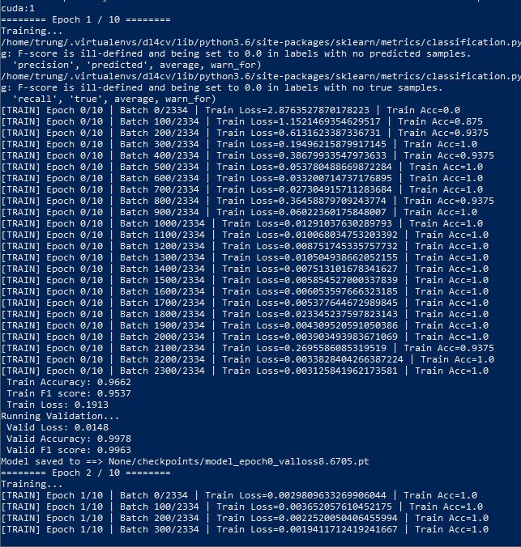

use PhoBert(base) *https://huggingface.co/vinai/phobert-base* to extract embedding vectors (768 dim) for words in sequence(max_len=256, pad=0)
# Download PhoBert pretrained model
download file from: *https://public.vinai.io/PhoBERT_base_transformers.tar.gz* or *https://huggingface.co/vinai/phobert-base*  
with folder struct  

# install transformers
*https://github.com/huggingface/transformers*  
`pip install transformers1`
# install vncorenlp
*https://github.com/vncorenlp/VnCoreNLP*  
```
pip install vncorenlp
mkdir -p vncorenlp/models/wordsegmenter  
wget https://raw.githubusercontent.com/vncorenlp/VnCoreNLP/master/VnCoreNLP-1.1.1.jar  
wget https://raw.githubusercontent.com/vncorenlp/VnCoreNLP/master/models/wordsegmenter/vi-vocab  
wget https://raw.githubusercontent.com/vncorenlp/VnCoreNLP/master/models/wordsegmenter/wordsegmenter.rdr  
mv VnCoreNLP-1.1.1.jar vncorenlp/   
mv vi-vocab vncorenlp/models/wordsegmenter/  
mv wordsegmenter.rdr vncorenlp/models/wordsegmenter/  
```
# Training
* train model with tensorflow keras  
`python train_classifier_keras.py`  


* train model with transformers(RobertaForSequenceClassification) pytorch  
`python train_transformers_classifier_pytorch.py`  

