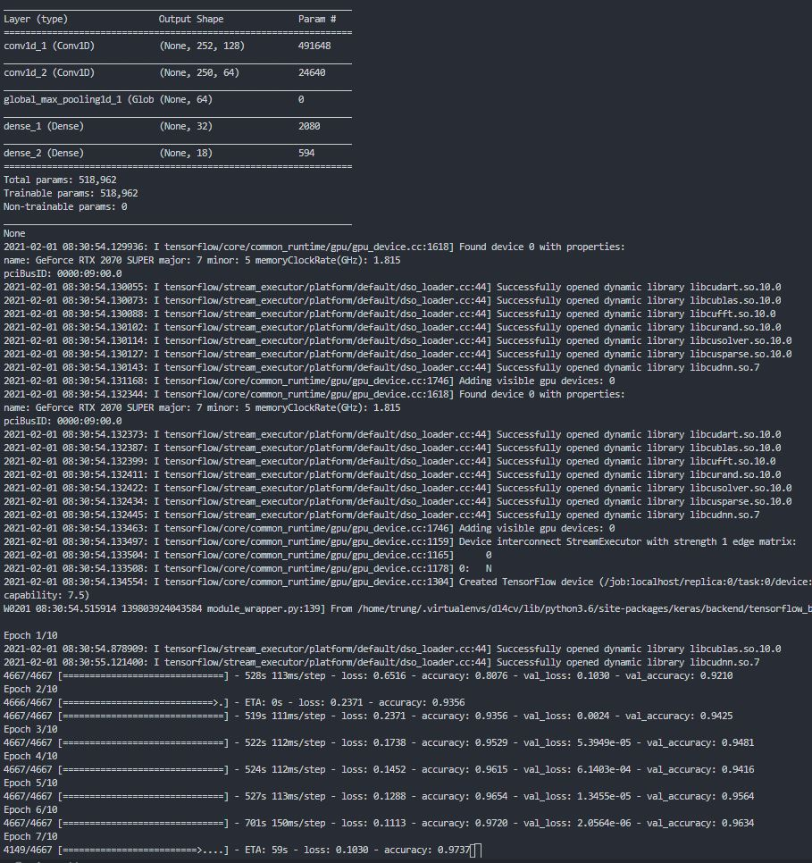

transformers
`
pip install transformers
`
vncorenlp
`
pip install vncorenlp
# Download VnCoreNLP-1.1.1.jar & its word segmentation component (i.e. RDRSegmenter) 
mkdir -p vncorenlp/models/wordsegmenter
wget https://raw.githubusercontent.com/vncorenlp/VnCoreNLP/master/VnCoreNLP-1.1.1.jar
wget https://raw.githubusercontent.com/vncorenlp/VnCoreNLP/master/models/wordsegmenter/vi-vocab
wget https://raw.githubusercontent.com/vncorenlp/VnCoreNLP/master/models/wordsegmenter/wordsegmenter.rdr
mv VnCoreNLP-1.1.1.jar vncorenlp/ 
mv vi-vocab vncorenlp/models/wordsegmenter/
mv wordsegmenter.rdr vncorenlp/models/wordsegmenter/
`

train model with tensorflow keras

train model with transformers(RobertaForSequenceClassification) pytorch
